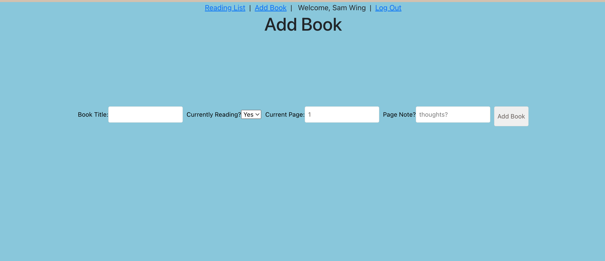
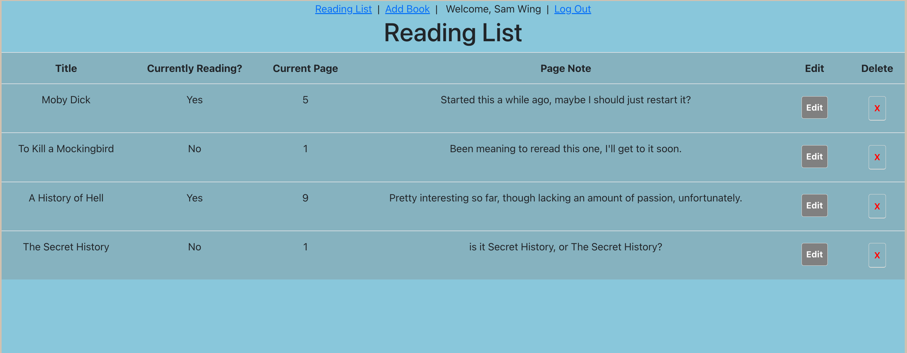

Book Tracker

This app is a simple way to track the books you're currently reading or looking to read soon, with fields to mark down the page you're on, and a note to accompany that page.

Page made using:
MongoDB, Express, React.js, Node.js, Javascript, HTML, CSS

[Check out my trello board](https://trello.com/b/AacrI8DS/react-book-tracker)

Next steps would be to be able to upload images of the cover of the book when adding a book to the list.